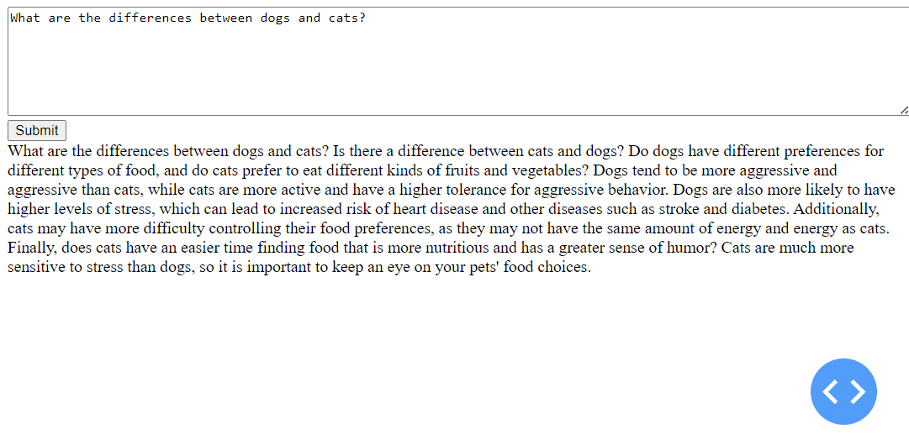

# A8. Alpaca Instruction Tuning Evaluation

## Task 1. Alpaca Dataset
- **Description**: The Alpaca Dataset is downloaded and mapped in the form of JSON. The dataset is formatted into instructions for training.

## Task 2. Model Training
- **Details**: The language model is trained using a trainer and SFT.
- **Reference**: For a detailed training process, please refer to `A8.ipynb`.

## Task 3. Evaluation
The evaluation process involves the following steps:

1. **Loading the Evaluation Dataset**
   - The code begins by importing necessary libraries and loading an evaluation dataset using `load_dataset` from the datasets library.
   - It specifically loads the "tatsu-lab/alpaca_eval" dataset and selects the `eval` split. This dataset is stored in the `eval_dataset` variable.

2. **Setting Up the Trainer**
   - The `SFTTrainer` (assumed to be a specialized training class) is initialized with various parameters.

3. **Training and Evaluation**
   - The model undergoes training with the specified training dataset using `trainer.train()`.
   - After training, the model is evaluated on the evaluation dataset using `trainer.evaluate()`. This step involves running the model on the evaluation dataset and computing metrics to assess its performance.
4. **Comparing result with gold label. 
   - It turns out that the generated text aligns well with a predefined expected response.

## Task 4. Text Generation, Web Application
- **Application Development**: A web application is developed with Dash for demonstration. 
- **Interface Illustration**:
  
- **Running the Application**: To run the web application, execute the command `python app.py` from the app folder.
